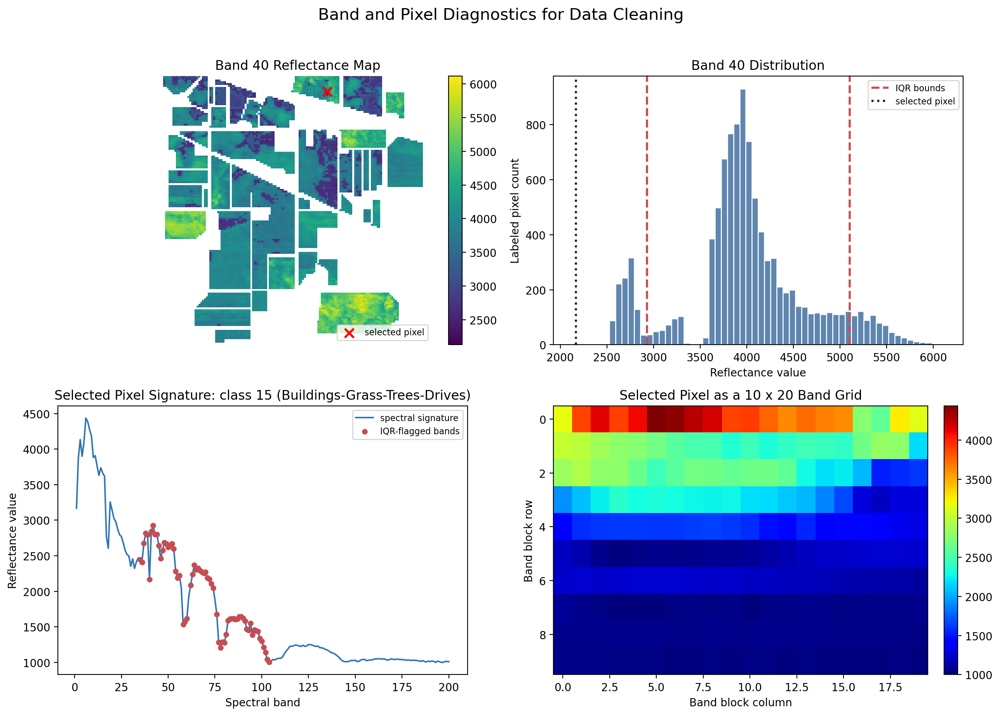
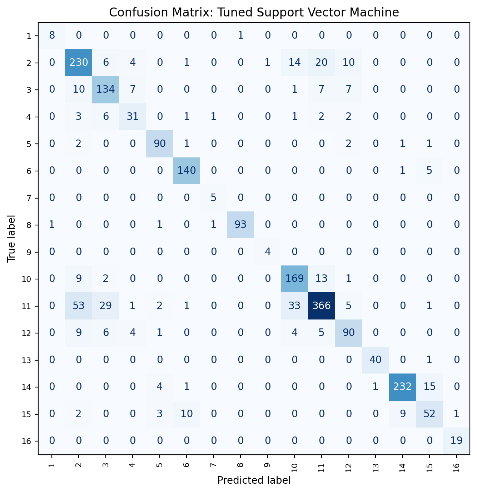
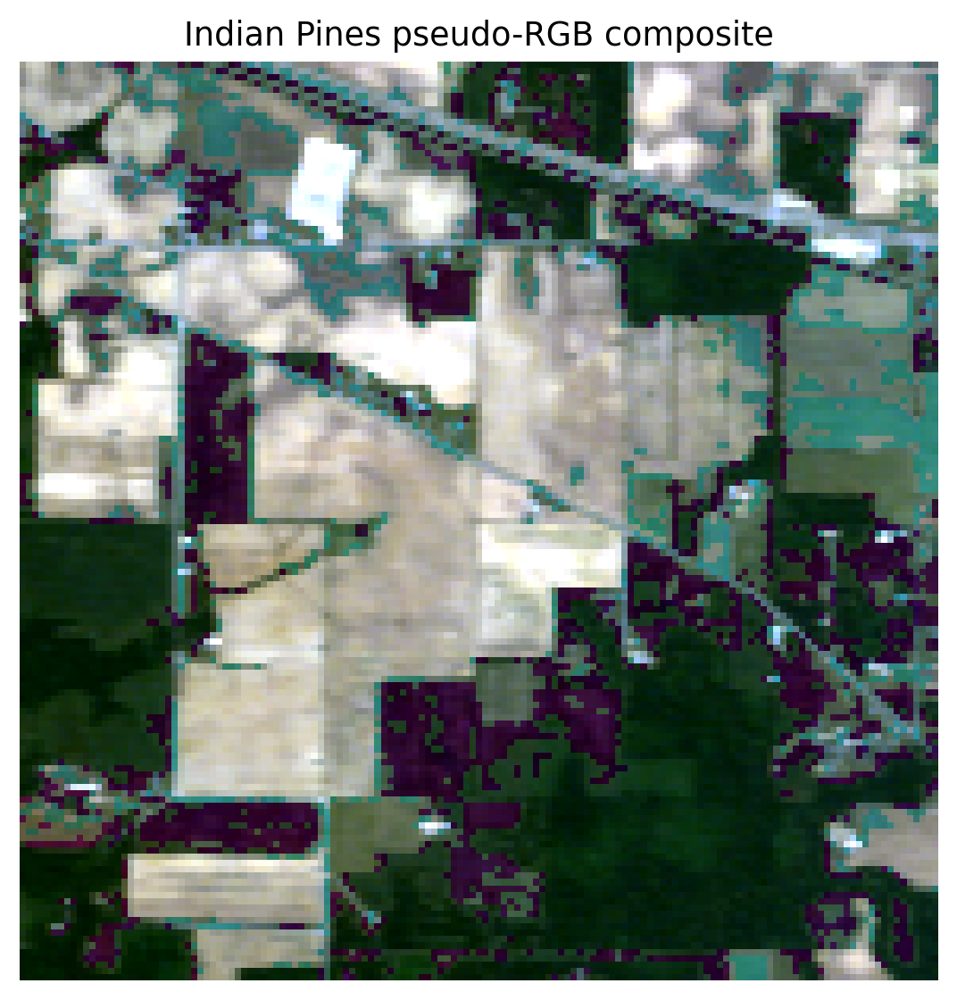
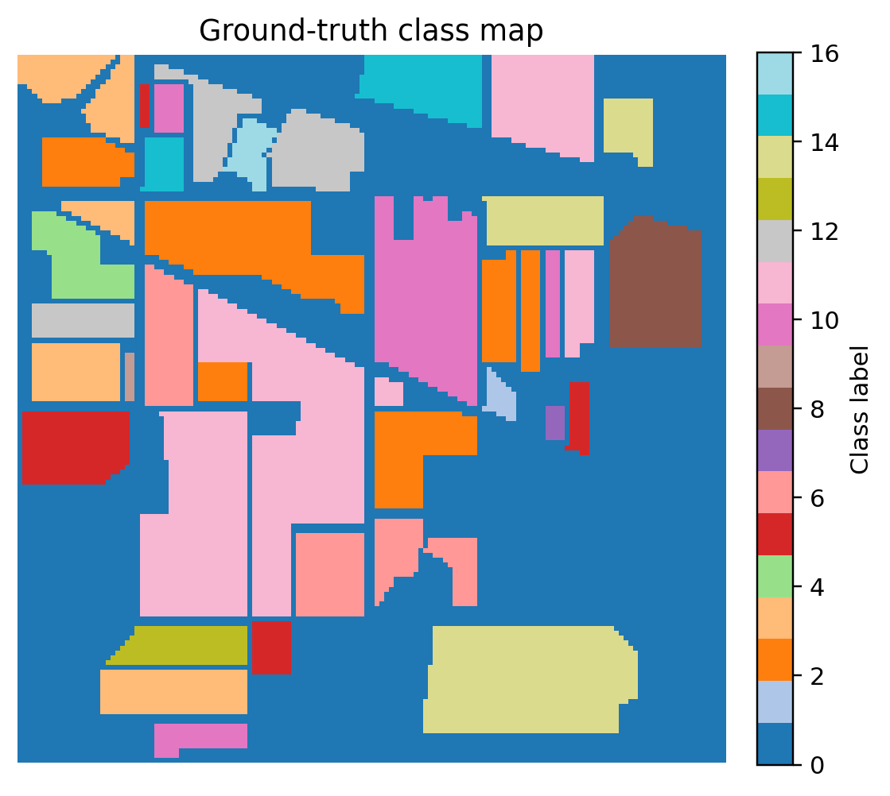
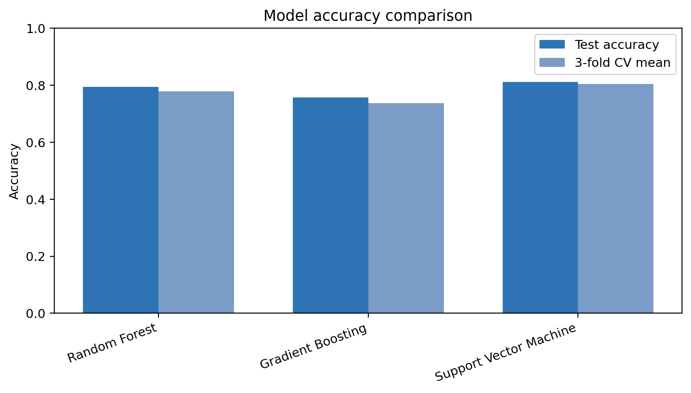
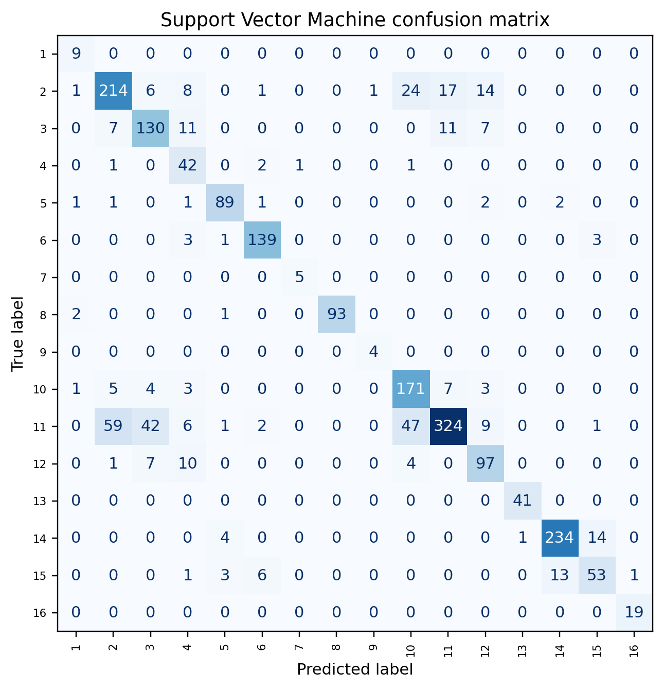
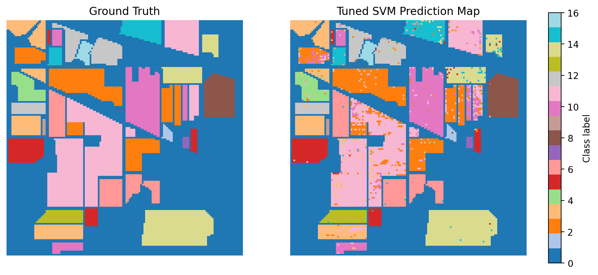

# Indian Pines Hyperspectral Image Classification

Data Mining and Analysis final project using the Indian Pines hyperspectral image dataset.

This project applies a complete data mining workflow to classify land-cover types from hyperspectral pixel signatures. The workflow includes dataset loading, visualization, data cleaning, preprocessing, PCA dimensionality reduction, supervised classification, model evaluation, cross-validation, and hyperparameter tuning.

## Project Overview

The selected problem is multi-class classification. The raw cube contains 220 spectral bands. The project removes known noisy and water-absorption bands from the raw file, producing the standard 200-band corrected representation used for modeling. Each labeled pixel is represented by 200 cleaned spectral bands, and the target is one of 16 land-cover classes.

- Dataset: Indian Pines hyperspectral image
- Image size: 145 x 145 pixels
- Raw spectral bands: 220
- Cleaned spectral bands used: 200
- Labeled pixels used for modeling: 10,249
- Classes: 16 land-cover categories
- Best model: Support Vector Machine

## Repository Contents

```text
.
|-- Indian Pines/
|   |-- Indian_pines.mat
|   |-- Indian_pines_corrected.mat
|   `-- Indian_pines_gt.mat
|-- outputs/
|   |-- figures/
|   |   |-- 01_pseudo_rgb.png
|   |   |-- 02_ground_truth.png
|   |   |-- 03_class_distribution.png
|   |   |-- 04_mean_spectra.png
|   |   |-- 05_band_correlation.png
|   |   |-- 06_cm_gradient_boosting.png
|   |   |-- 06_cm_random_forest.png
|   |   |-- 06_cm_support_vector_machine.png
|   |   |-- 07_iqr_outlier_flags_by_band.png
|   |   |-- 08_band_pixel_cleaning_diagnostics.png
|   |   |-- 09_accuracy_comparison.png
|   |   |-- 10_pca_explained_variance.png
|   |   |-- 11_prediction_map.png
|   |   `-- 12_cm_tuned_support_vector_machine.png
|   |-- analysis_summary.json
|   |-- baseline_model_results.json
|   |-- data_quality_summary.json
|   |-- enhanced_data_mining_summary.json
|   `-- svm_tuning_results.json
|-- Indian_Pines_Data_Mining_Project_Notebook.ipynb
|-- Indian_Pines_Data_Mining_Report.tex
|-- hsi_data_mining.pdf
|-- requirements.txt
`-- README.md
```

## Workflow

1. Load the raw hyperspectral cube and ground-truth labels.
2. Remove known noisy/water-absorption bands from the raw cube: 104-108, 150-163, and 220.
3. Verify that the cleaned cube matches `Indian_pines_corrected.mat`.
4. Remove unlabeled pixels with class label 0.
5. Explore the data using pseudo-RGB visualization, ground-truth mapping, class distribution, spectral signatures, and correlation analysis.
6. Audit data quality by checking missing values, infinite values, duplicate rows, and IQR-based outlier flags.
7. Preprocess features using median imputation, standardization, and PCA.
8. Train and compare baseline and main classifiers.
9. Evaluate performance using test accuracy, macro F1-score, weighted F1-score, confusion matrices, and 3-fold stratified cross-validation.
10. Tune Support Vector Machine with RandomizedSearchCV and GridSearchCV.

## Data Cleaning Summary

The project starts from `Indian_pines.mat`, the raw 220-band cube. Bands 104-108, 150-163, and 220 are removed because they are known noisy/water-absorption bands. The cleaned result is exactly equal to `Indian_pines_corrected.mat`, so the notebook both demonstrates the cleaning step and keeps the standard benchmark representation.

The cleaned dataset contains no missing values, no infinite values, and no duplicate spectral rows among labeled pixels. IQR diagnostics identified unusual reflectance values, but these values were retained because hyperspectral outliers can represent valid material signatures. Removing them automatically could also reduce already-small minority classes such as Oats, Grass-pasture-mowed, and Alfalfa.

The cleaning section includes a deterministic diagnostic figure inspired by common hyperspectral visualization notebooks:



## Model Results

| Model | Test Accuracy | 3-Fold CV Accuracy | Macro F1 | Weighted F1 |
| --- | ---: | ---: | ---: | ---: |
| Most Common Class | 0.240 | 0.240 +/- 0.000 | 0.024 | 0.093 |
| k-Nearest Neighbors | 0.749 | 0.742 +/- 0.011 | 0.715 | 0.740 |
| Random Forest | 0.794 | 0.778 +/- 0.007 | 0.749 | 0.786 |
| Gradient Boosting | 0.757 | 0.737 +/- 0.006 | 0.682 | 0.750 |
| Support Vector Machine | **0.812** | **0.804 +/- 0.007** | **0.840** | **0.813** |

Support Vector Machine produced the strongest untuned result, with the best test accuracy, cross-validation accuracy, and macro F1-score.

## Tuned SVM Result

Because SVM was the best untuned model, hyperparameter tuning was applied to SVM instead of Random Forest. The best grid-search parameters were:

```text
C = 30
gamma = 0.03
```

The tuned SVM achieved:

```text
Test accuracy: 0.831
Macro F1:      0.848
Weighted F1:   0.831
```

Tuned SVM confusion matrix:



## Key Visualizations

Pseudo-RGB image:



Ground-truth class map:



Model accuracy comparison:



Support Vector Machine confusion matrix:



Tuned SVM prediction map:



## How To Run

Create a Python environment and install the dependencies:

```bash
python -m venv .venv
.venv\Scripts\activate
pip install -r requirements.txt
```

Then open and run:

```text
Indian_Pines_Data_Mining_Project_Notebook.ipynb
```

The notebook expects the dataset files to be in:

```text
Indian Pines/
```

Generated figures and JSON summaries are saved under:

```text
outputs/
```

## Notes

- Random seed: 42
- Train/test split: 80/20 stratified split
- Raw-band cleaning: remove bands 104-108, 150-163, and 220
- PCA components: 20
- PCA explained variance with 20 components: approximately 97.64%
- Cross-validation: 3-fold stratified cross-validation
- Feature encoding: no one-hot encoding was applied because all predictors are continuous spectral bands
